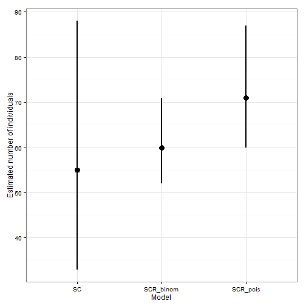

Estimating number of brown bears in Slovenia has been done using various methods. One common method is using capture-mark-recapture (CMR), where capture history of individuals is known. An alternative way is using a method termed "permanent count sites", where on, as you might have guessed it, permanent counting sites, hunters count number of bears. Counting is done in special weather conditions and at night. This kind of data could be analyzed using spatial count model. I will dwell into efford required for one or the other later.

Let's first have a look at how well can population size be estimated using both methods. Based on the code from Spatial capture-recapture by Royle et al. (2014) I will attempt to generate capture histories for individuals and for my next trick, use CMR method to estimate population size and then use a SC model on the collapsed capture histories of individuals. In other terms, I will use only the number of bears counted at a specific counting site.

```{r setup}
library(scrbook)
library(coda)
library(ggplot2)
```

```{r simulate_data}
tr <- seq(15, 85, length = 10)

# create trap grid
X <- expand.grid(x = tr, y = tr)

# S
xlim <- c(0, 100)
ylim <- c(0, 100)

set.seed(1015)
# A = area of S
A <- (diff(xlim) * diff(ylim))/1e4

mu <- 50
N <- rpois(1, mu * A)
# we thus treat number of individuals as a Poisson random variable

s <- cbind(
    runif(N, min = xlim[1], max = xlim[2]),
    runif(N, min = ylim[1], max = ylim[2])
)

# generate encounter histories under the Poisson model
sigma <- 5       # detection parameter
lam0 <- 0.4      # base detection
J <- nrow(X)     # number of traps
K <- 5           # number of trapping sessions
y <- array(NA, c(N, J, K))

for (j in 1:J) {
    dist <- sqrt((X[j, 1] - s[, 1])^2 + (X[j, 2] - s[, 2])^2)
    lambda <- lam0 * exp(-dist^2/(2 * sigma^2))
    for (k in 1:K) {
        y[, j, k] <- rpois(N, lambda)
    }
}

```

## Capture-mark-recapture models
```{r prepare_data_scr}
### CMR model
# augment data - add M-nrow(y) of "phantom" individuals
M <- 123
# for each trap (J of them), record how many time an individual has been captured
bin.y <- apply(y, MARGIN = 1:2, FUN = sum)
augmented.y <- matrix(0, nrow = M, ncol = ncol(bin.y))
augmented.y[1:nrow(bin.y), ] <- bin.y

# find outer bounds of the trapping grid and add padding
padding <- 20
xl <- min(X$x) - padding
xu <- max(X$x) + padding
yl <- min(X$y) - padding
yu <- max(X$y) + padding

start <- 5000
niter <- 25000
```

### SCR model with Poisson encounter process
See page 452 of the book by Royle et al. (2014)
```{r scr_poisson, eval = FALSE}
set.seed(9)
mark.pois.N <- SCR0pois(y = augmented.y, X = X, M = M, xl = xl, 
                        xu = xu, yl = yl, yu = yu, delta = c(1, 0.1, 2), 
                        niter = niter)

save(mark.pois.N, file = "pois.N.RData")
```

```{r scr_poisson_results, fig.width = 5, fig.height = 8}
load("pois.N.RData")
mark.pois.N.mcmc <- mcmc(mark.pois.N)
plot(window(mark.pois.N.mcmc, start = start))
(s.scr.p <- summary(window(mark.pois.N.mcmc, start = start)))
```

### Model with binomial encounter process
See page 455 of the book by Royle et al. (2014)
```{r scr_binom_model, eval = FALSE}
binom.augmented.y <- augmented.y
binom.augmented.y[binom.augmented.y > 0] <- 1

set.seed(12)
mark.binom.N <- SCR0binom.cl(y = binom.augmented.y, X = X, M = M, xl = xl,
                             xu = xu, yl = yl, yu = yu, K = K, 
                             delta = c(1, 0.1, 2), niter = niter)

save(mark.binom.N, file = "binom.N.RData")
```

```{r cmr_model_results, fig.width = 5, fig.height = 8}
load("binom.N.RData")
mark.binom.N.mcmc <- mcmc(mark.binom.N)
plot(window(mark.binom.N.mcmc, start = start))
(s.scr.b <- summary(window(mark.binom.N.mcmc, start = start)))
```

## Spatial count model
```{r sc_model, eval = FALSE}
# sum the data for each trap across all individuals
n <- apply(y, MARGIN = c(2, 3), FUN = sum)

dimnames(n) <- list(paste("trap", 1:J, sep = ""),
                    paste("occasion", 1:K, sep = ""))

un.N <- scrUN(n = n, X = X, M = M, niter = niter, xlims = xlim, ylims = ylim,
              inits = list(lam0 = 0.1, sigma = rnorm(1, mean = 5, sd = 0.1)), updateY = FALSE,
              tune = c(0.004, 0.09, 0.35))

save(un.N, file = "sc.RData")
```

```{r sc_model_results, fig.width = 5, fig.height = 8}
load("sc.RData")
un.sc.mcmc <- mcmc(un.N[[1]])
plot(window(un.sc.mcmc, start = start))
(s.sc <- summary(window(un.sc.mcmc)))
```

# Results
```{r present_results, fig.show = "hide", fig.width = 5, fig.height = 5}
s <- data.frame(c("SCR_pois", "SCR_binom", "SC"),
           rbind(s.scr.p$quantiles["N", ],
                 s.scr.b$quantiles["N", ],
                 s.sc$quantiles["N", ]))
names(s) <- c("model", "q2.5", "q25", "q50", "q75", "q97.5")

ggplot(s, aes(x = model, y = q50)) +
    theme_bw() +
    ylab("Estimated number of individuals") +
    xlab("Model") +
    geom_pointrange(aes(ymin = q2.5, ymax = q97.5), size = 1)
```




